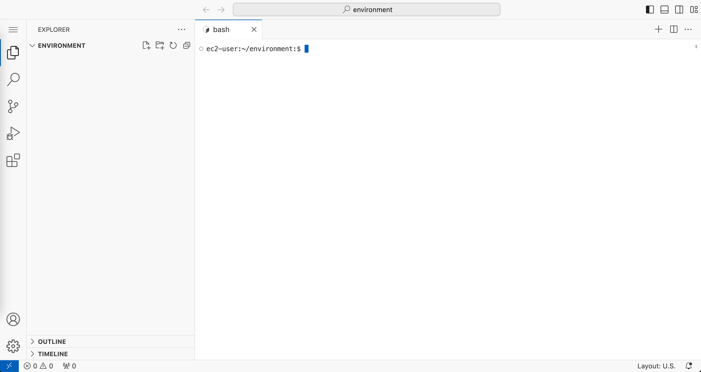

# Workshop Navigation Guide

[Home](../README.md) > [Workshop Setup](README.md) > Navigation Guide

## Overview

This guide will help you navigate the workshop materials effectively using VS Code's features. All workshop content is provided as markdown files that you can view in VS Code's preview mode.

## VS Code Interface Overview

### File Explorer
- **Location**: Left sidebar (or press `Ctrl+Shift+E`)
- **Purpose**: Browse and open workshop files
- **Tip**: The `Environment` folder contains all workshop materials, and `eksctl` contains the cluster configuration for the running EKS cluster in your account 

### Editor Area
- **Location**: Center of the screen
- **Purpose**: View and edit files
- **Modes**: Source view and Preview mode for markdown files

### Integrated Terminal
- **Location**: Bottom panel (or press `Ctrl+`` backtick)
- **Purpose**: Run commands during the workshop
- **Tip**: You can have multiple terminal tabs open



## Working with Markdown Files

### Opening Files
1. Click on any `.md` file in the file explorer
2. The file opens in source view by default
3. Use preview mode for better readability (see below)

### Markdown Preview Mode
**Essential for this workshop!** Preview mode renders markdown with proper formatting, images, and clickable links.

**Ways to open preview:**
- `Ctrl+Shift+V` - Open preview in current tab
- `Ctrl+K V` - Open preview side-by-side with source
- Right-click file → "Open Preview"

### Navigation Between Files
- **Click links**: In preview mode, click any link to navigate
- **Breadcrumbs**: Use the breadcrumb navigation at the top of each file
- **File explorer**: Browse the folder structure
- **Quick open**: Press `Ctrl+P` and type filename

## Workshop File Structure

```
environment/
├── README.md                          # Main workshop entry point
├── eksctl/                            # Running EKS Cluster configuration
│   └── config.yaml                    
├── 00-workshop-setup/                 # Getting started materials
│   ├── README.md
│   ├── 01-vscode-connection.md        # This guide's prerequisite
│   └── 02-navigation-guide.md         # This file
├── 01-module1-hpc-kubernetes/         # Main workshop content
│   ├── README.md                      # Module overview
│   └── module1.md
├── 02-module2-flux-lammps/            # Future content
├── 03-module3-mummi-workflows/        # Future content
└── images/                            # Workshop images
```

## Essential VS Code Shortcuts

### File Navigation
- `Ctrl+P` - Quick open file by name
- `Ctrl+Shift+E` - Focus file explorer
- `Ctrl+Tab` - Switch between open files
- `Ctrl+W` - Close current file

### Markdown Specific
- `Ctrl+Shift+V` - Toggle markdown preview
- `Ctrl+K V` - Open preview to the side
- `Ctrl+Shift+F` - Search across all files

### Terminal
- `Ctrl+`` - Toggle terminal panel
- `Ctrl+Shift+`` - Create new terminal
- `Ctrl+C` - Stop running command

### General
- `Ctrl++` / `Ctrl+-` - Zoom in/out
- `Ctrl+,` - Open settings
- `F11` - Toggle fullscreen

## Workshop Navigation Strategy

### Recommended Workflow
1. **Start with overview**: Always read the module README first
2. **Follow the sequence**: Use numbered files (01-, 02-, etc.) in order
3. **Use breadcrumbs**: Navigate up/down the hierarchy as needed
4. **Keep terminal ready**: Have the integrated terminal open for commands

### Following Links
- **Internal links**: Click to navigate between workshop sections
- **External links**: Open in new browser tab (Ctrl+click)
- **Command blocks**: Copy commands to the terminal

### Managing Multiple Files
- **Side-by-side**: Open instructions in preview, keep terminal visible
- **Multiple tabs**: Keep related files open in tabs
- **Split editor**: Use `Ctrl+\` to split the editor for multiple views

## Tips for Success

### Reading Workshop Content
> **💡 Tip:** Always use markdown preview mode for workshop materials. The formatting, images, and navigation work much better in preview.

### Running Commands
> **💡 Tip:** Copy commands from the preview mode and paste them into the integrated terminal. This ensures accuracy and saves time.

### Staying Organized
> **💡 Tip:** Follow the numbered sequence in each module. The content builds progressively, and skipping sections may cause issues.

### Getting Help
> **💡 Tip:** If you get lost, return to the main [workshop README](../README.md) or the current module's README for orientation.

## Troubleshooting

### Preview Not Working
- Ensure you're viewing a `.md` file
- Try `Ctrl+Shift+V` to toggle preview
- Check that the file isn't corrupted

### Links Not Clickable
- Make sure you're in preview mode, not source view
- Links only work in markdown preview

### Can't Find Files
- Use `Ctrl+P` and start typing the filename
- Check the file explorer for the correct folder structure
- Ensure you're in the `workshop-assets` directory

### Terminal Issues
- Press `Ctrl+`` to toggle terminal visibility
- Create a new terminal with `Ctrl+Shift+``
- Make sure you're in the correct directory (`pwd` to check)

## Ready to Start!

Now that you understand how to navigate the workshop materials, you're ready to begin the technical content. 

**Next step**: Head to [Module 1: HPC on Kubernetes](../02-module1-hpc-kubernetes/README.md) to start the hands-on workshop.

---
**Navigation:**
- Previous: [VS Code Connection Guide](01-vscode-connection.md)
- Next: [Module 1: HPC on Kubernetes](../01-module1-hpc-kubernetes/README.md)
- Up: [Workshop Setup](README.md)
