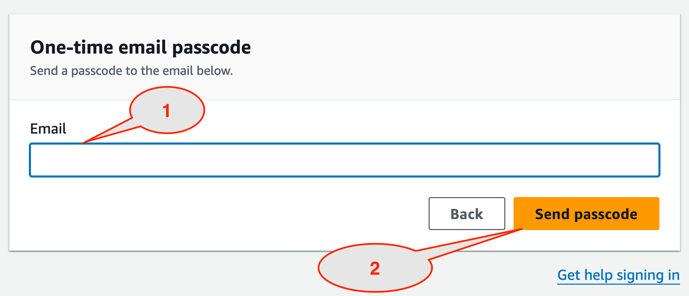
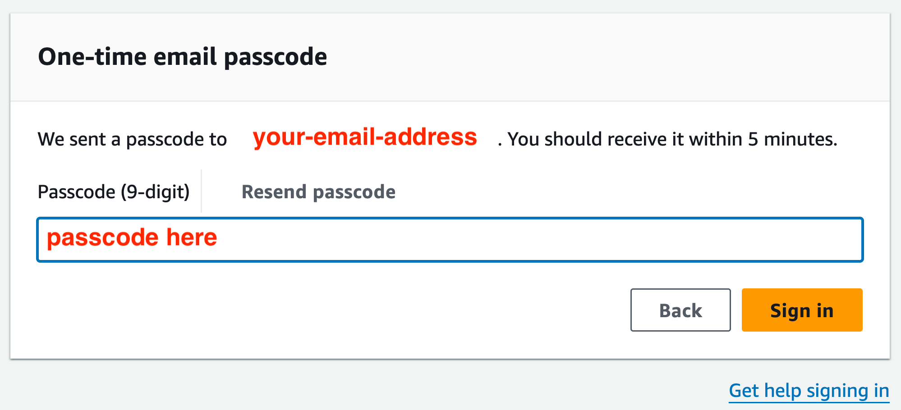
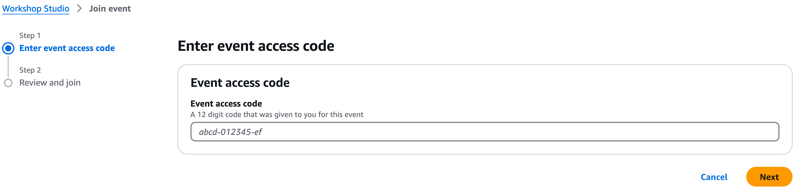
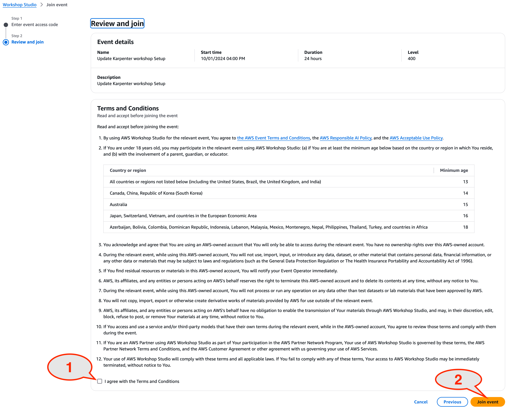
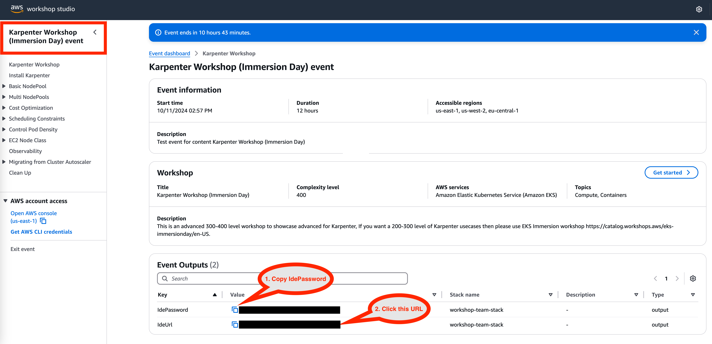
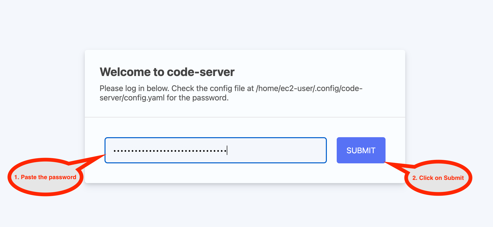

# VS Code Connection Guide

[Home](../README.md) > [Workshop Setup](README.md) > VS Code Connection

## Overview

This guide will help you connect to your VS Code development environment for the workshop. Your VS Code server has been pre-configured with all the tools and materials you need.

## Connecting to VS Code

### At an AWS Event

If you're attending this workshop at an AWS event, your VS Code environment has been pre-provisioned. Follow these steps:

1. **Access Workshop Studio**
   - Open the [Workshop Studio login page](https://catalog.us-east-1.prod.workshops.aws/join)
   - Select **Email One-Time Password (OTP)** when prompted

2. **Sign In Process**
   - Enter your email address and select "Send passcode"
   
   
   
   - Check your email for the 9-digit passcode
   - Enter the passcode and select "Sign in"
   
   

3. **Join the Event**
   - If prompted, enter the event access code provided by the instructors
   
   
   
   - Read and accept the Terms and Conditions
   - Select **Join event** to continue
   
   

4. **Access Your VS Code Environment**
   - In Workshop Studio, scroll to the **Event Outputs** section
   - Copy the provided password
   
   
   
   - Click on **IdeUrl** to open your VS Code environment
   - Paste the password when prompted and click Submit
   
   

### Connection Troubleshooting

> **💡 Tip:** If VS Code doesn't load properly, try refreshing the browser or clearing your browser cache.

> **🚨 Warning:** Keep your Workshop Studio session active. If you close the tab, you can return using the same email address.

#### Common Issues

**VS Code won't load:**
- Ensure you're using a supported browser (Chrome, Firefox, Safari, Edge)
- Disable browser extensions that might interfere
- Try an incognito/private browsing window

**Can't paste commands:**
- For Firefox users: Enable clipboard permissions in `about:config`
- Set these to `true`: `dom.events.asyncClipboard.clipboardItem`, `dom.events.asyncClipboard.readText`, `dom.events.testing.asyncClipboard`

**Lost connection:**
- Return to Workshop Studio using the same email
- Your environment and progress are preserved
- Click the IdeUrl again to reconnect

## Verifying Your Environment

Once connected to VS Code, verify your environment is ready:

1. **Open the Terminal**
   - Press `Ctrl+`` (backtick) or use View > Terminal
   - You should see a bash prompt

2. **Check AWS CLI**
   ```bash
   aws --version
   ```
   You should see AWS CLI version information.

3. **Verify Workshop Materials**
   - In the file explorer, you should see a `workshop-assets` folder
   - This contains all the workshop materials

4. **Test Markdown Preview**
   - Open any `.md` file from the workshop-assets folder
   - Press `Ctrl+Shift+V` to open preview mode
   - You should see formatted content

## Next Steps

Once you're successfully connected and have verified your environment, proceed to the [Workshop Navigation Guide](02-navigation-guide.md) to learn how to use VS Code effectively for this workshop.

---
**Navigation:**
- Previous: [Workshop Setup Overview](README.md)
- Next: [Workshop Navigation Guide](02-navigation-guide.md)
- Up: [Workshop Setup](README.md)