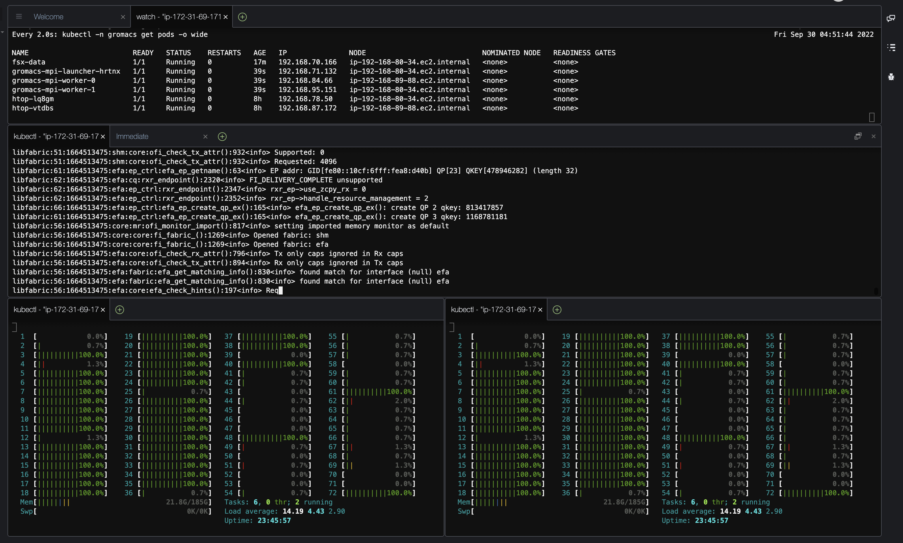
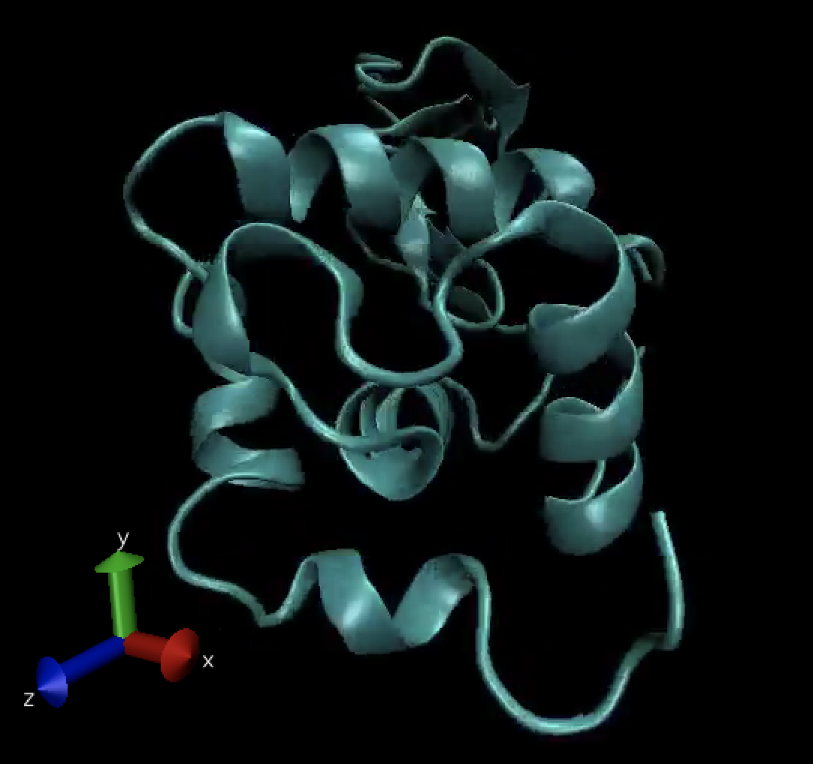

# Run GROMACS MPI Job

[Home](../README.md) > [Module 1](README.md) > Run GROMACS MPI Job

## Overview

In this section, you will run a GROMACS MPI job distributed across nodes in your Kubernetes cluster. GROMACS will simulate a protein (lysozyme) in a box of water with ions, demonstrating how to run tightly coupled HPC workloads on Kubernetes.

## Create MPIJob Manifest

Execute the code block below to create a file named `gromacs-mpi.yaml`, containing an MPIJob manifest:

```bash
cat > ~/environment/gromacs-mpi.yaml << EOF
apiVersion: kubeflow.org/v2beta1
kind: MPIJob
metadata:
  name: gromacs-mpi
  namespace: gromacs
spec:
  slotsPerWorker: 48
  runPolicy:
    cleanPodPolicy: Running
  mpiReplicaSpecs:
    Launcher:
      replicas: 1
      template:
         spec:
          restartPolicy: OnFailure
          volumes:
          - name: cache-volume
            emptyDir:
              medium: Memory
              sizeLimit: 2048Mi
          - name: data
            persistentVolumeClaim:
              claimName: fsx-pvc
          initContainers:
          - image: "${IMAGE_URI}"
            name: init
            command: ["sh", "-c", "cp /inputs/* /data; sleep 5"]
            volumeMounts:
            - name: data
              mountPath: /data
          containers:
          - image: "${IMAGE_URI}"
            imagePullPolicy: Always
            name: gromacs-mpi-launcher
            volumeMounts:
            - name: cache-volume
              mountPath: /dev/shm
            - name: data
              mountPath: /data
            env:
            - name: OMPI_MCA_verbose
              value: "1"
            command:
            - /opt/view/bin/mpirun
            - --allow-run-as-root
            - --oversubscribe
            - -x
            - FI_LOG_LEVEL=warn
            - -x
            - FI_PROVIDER=shm,sockets
            - -np
            - "48"
            - -npernode
            - "48"
            - --bind-to
            - "core"
            - /opt/view/bin/gmx_mpi
            - mdrun
            - -ntomp
            - "1"
            - -deffnm
            - "/data/md_0_1"
            - -s
            - "/data/md_0_1.tpr"
    Worker:
      replicas: 1
      template:
        spec:
          volumes:
          - name: cache-volume
            emptyDir:
              medium: Memory
              sizeLimit: 2048Mi
          - name: data
            persistentVolumeClaim:
              claimName: fsx-pvc
          containers:
          - image: "${IMAGE_URI}"
            imagePullPolicy: Always
            name: gromacs-mpi-worker
            volumeMounts:
            - name: cache-volume
              mountPath: /dev/shm
            - name: data
              mountPath: /data
            resources:
              limits:
                memory: 8000Mi
              requests:
                memory: 8000Mi
EOF
```

## Run the GROMACS MPIJob

Launch the GROMACS MPIJob:

```bash
kubectl apply -f ~/environment/gromacs-mpi.yaml
```

Watch the pods in the gromacs namespace until the launcher pod enters `Running` state:

```bash
kubectl get pods -n gromacs -w
```

Press `Ctrl-C` to exit the watch command.

## Monitor Job Progress

Follow the launcher logs while the pod is in Running state:

```bash
kubectl -n gromacs logs -f $(kubectl -n gromacs get pods | grep gromacs-mpi-launcher | head -n 1 | cut -d ' ' -f 1)
```

You should see GROMACS log entries similar to the ones shown below. The job output will hang on the line `50000 steps, 100.0 ps.` while the simulation runs and will report the rest upon completion.

```console
...
50000 steps,    100.0 ps.

Writing final coordinates.

Dynamic load balancing report:
 DLB was off during the run due to low measured imbalance.
 Average load imbalance: 24.7%.
 The balanceable part of the MD step is 56%, load imbalance is computed from this.
 Part of the total run time spent waiting due to load imbalance: 13.8%.
 Average PME mesh/force load: 1.091
 Part of the total run time spent waiting due to PP/PME imbalance: 4.6 %

NOTE: 13.8 % of the available CPU time was lost due to load imbalance
      in the domain decomposition.
      Dynamic load balancing was automatically disabled, but it might be beneficial to manually tuning it on (option -dlb on.)
      You can also consider manually changing the decomposition (option -dd);
      e.g. by using fewer domains along the box dimension in which there is
      considerable inhomogeneity in the simulated system.

               Core t (s)   Wall t (s)        (%)
       Time:     2971.865       41.276     7199.9
                 (ns/day)    (hour/ns)
Performance:      209.325        0.115
```

Press `Ctrl-C` to stop following the log.

## Monitor Cluster Utilization

While waiting for the GROMACS MPIJob to complete, explore the cluster utilization:

```bash
kubectl top node
```

Example output:

```console
NAME                                            CPU(cores)   CPU%   MEMORY(bytes)   MEMORY%
ip-192-168-86-187.ec2.internal                  36114m       37%    5275Mi          1%
```

You should notice increased utilization of the cluster node cores, indicating that the MPI job is running.



## Clean Up the Job

After the job completes, delete the GROMACS MPIJob:

```bash
kubectl delete -f ~/environment/gromacs-mpi.yaml
```

## Examine Output Files

Congratulations! You have successfully run a tightly coupled MPI job using GROMACS to simulate a protein (lysozyme) in a box of water with ions.

The output files are stored in the FSx volume. Let's examine them by mounting the volume in a new pod.

Create a pod manifest to access the FSx data:

```bash
cat > ~/environment/fsx-data.yaml << EOF
apiVersion: v1
kind: Pod
metadata:
  name: fsx-data
  namespace: gromacs
spec:
  containers:
  - name: app
    image: amazonlinux:2
    command: ["/bin/sh"]
    args: ["-c", "while true; do date; sleep 5; done"]
    volumeMounts:
    - name: data
      mountPath: /data
  volumes:
  - name: data
    persistentVolumeClaim:
      claimName: fsx-pvc
EOF
```

Create the pod:

```bash
kubectl apply -f ~/environment/fsx-data.yaml
```

Check the pod status:

```bash
kubectl -n gromacs get pods
```

Once the pod is in `Running` state, open a shell into it:

```bash
kubectl -n gromacs exec -it $(kubectl -n gromacs get pods | grep fsx-data | head -n 1 | cut -d ' ' -f 1) -- bash
```

### Examine the File System

Describe the volumes mounted in the pod:

```bash
df -h
```

Expected output:

```console
Filesystem                     Size  Used Avail Use% Mounted on
overlay                         30G  6.7G   24G  23% /
tmpfs                           64M     0   64M   0% /dev
tmpfs                          185G     0  185G   0% /sys/fs/cgroup
192.168.106.172@tcp:/aqbp5bmv  1.1T   16M  1.1T   1% /data
/dev/nvme0n1p1                  30G  6.7G   24G  23% /etc/hosts
shm                             64M     0   64M   0% /dev/shm
tmpfs                          185G   12K  185G   1% /run/secrets/kubernetes.io/serviceaccount
tmpfs                          185G     0  185G   0% /proc/acpi
tmpfs                          185G     0  185G   0% /sys/firmware
```

Notice the FSx volume is mounted under `/data`.

### View Output Files

Check the output data from the GROMACS MPI job:

```bash
ls -alh /data
```

You should see files like:

```console
total 9.4M
drwxr-xr-x 3 root root  33K Sep 30 04:29 .
drwxr-xr-x 1 root root   29 Sep 30 04:34 ..
-rw-r--r-- 1 root root 797K Sep 30 04:29 md_0_1.cpt
-rw-r--r-- 1 root root 8.2K Sep 30 04:29 md_0_1.edr
-rw-r--r-- 1 root root 2.3M Sep 30 04:29 md_0_1.gro
-rw-r--r-- 1 root root  36K Sep 30 04:29 md_0_1.log
-rw-r--r-- 1 root root 1.3M Sep 30 04:29 md_0_1.xtc
```

### Understanding the Output Files

These are the files that the GROMACS simulation produced:

- **`md_0_1.log`**: Contains the GROMACS run output logs (you can open and inspect this)
- **`md_0_1.gro`**: Contains the encoded protein structure
- **`md_0_1.xtc`**: Contains particle trajectory information
- **`md_0_1.edr`**: Contains information about physical quantities (energy, temperature, pressure)
- **`md_0_1.cpt`**: Contains checkpoint/restore data (can be used to resume the simulation)

When you're done inspecting the data files, exit the pod shell:

```bash
exit
```

## Visualization (Optional)

> **💡 Tip:** If you copy the output data to a Linux desktop, it can be visualized with the [VMD](http://www.ks.uiuc.edu/Research/vmd/) tool using the command: `/usr/local/bin/vmd md_0_1.gro md_0_1.xtc`

The visualization would show the protein structure and can be displayed as a movie over time, showing the molecular dynamics simulation results.



## Summary

You have successfully:
- Deployed a tightly coupled MPI job on Kubernetes
- Used FSx for Lustre for high-performance storage
- Run a real scientific application (GROMACS) 
- Examined the simulation output files

This demonstrates how Kubernetes can effectively orchestrate HPC workloads in the cloud.

---
**Navigation:**
- Previous: [Deploy MPI Operator](06-deploy-mpi-operator.md)
- Next: [Cleanup](08-cleanup.md)
- Up: [Module 1](README.md)