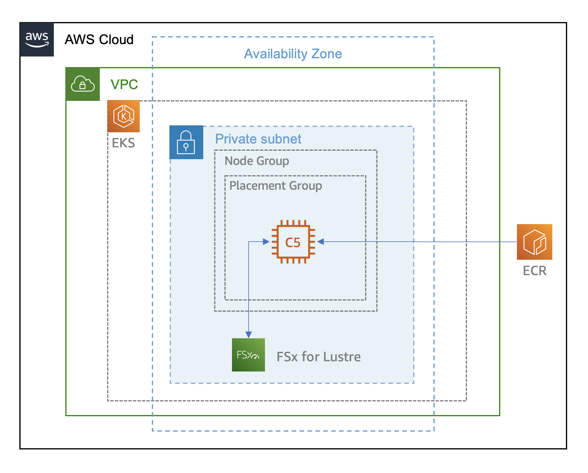

# Module 1: HPC on Kubernetes (Amazon EKS)

[Home](../README.md) > Module 1: HPC on Kubernetes

## Overview

In this module, you will deploy and use Kubernetes for running HPC applications. You'll run GROMACS, a high-performance molecular dynamics application, using data from Amazon FSx for Lustre parallel file system.

Amazon EKS simplifies Kubernetes deployment in the cloud, managing the control plane while you focus on running your applications.

## Architecture

As part of this module, you will deploy the following architecture to run GROMACS:

## Contents

1. [Install CLIs](01-install-clis.md)
2. [Create Amazon EKS Cluster](02-create-eks-cluster.md)
3. [Validate Amazon EKS Cluster](03-validate-eks-cluster.md)
4. [Create Persistent Volume](04-create-persistent-volume.md)
5. [Setup Monitoring](05-setup-monitoring.md)
6. [Deploy MPI Operator](06-deploy-mpi-operator.md)
7. [Run GROMACS MPI Job](07-run-gromacs-mpi.md)
8. [Cleanup](08-cleanup.md)
9. [Scale Out (Optional)](09-scale-out-optional.md)

## Prerequisites

- Completed workshop setup
- Access to AWS account (provided during event)
- Basic understanding of containers and Kubernetes concepts

## Estimated Time

30 minutes - 1 hour

---
**Navigation:**
- Previous: [Workshop Setup](../01-workshop-setup/README.md)
- Next: [Install CLIs](01-install-clis.md)
- Up: [Workshop Home](../README.md)